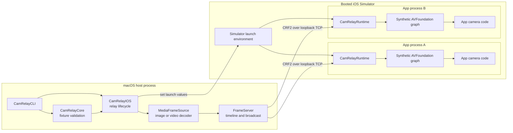
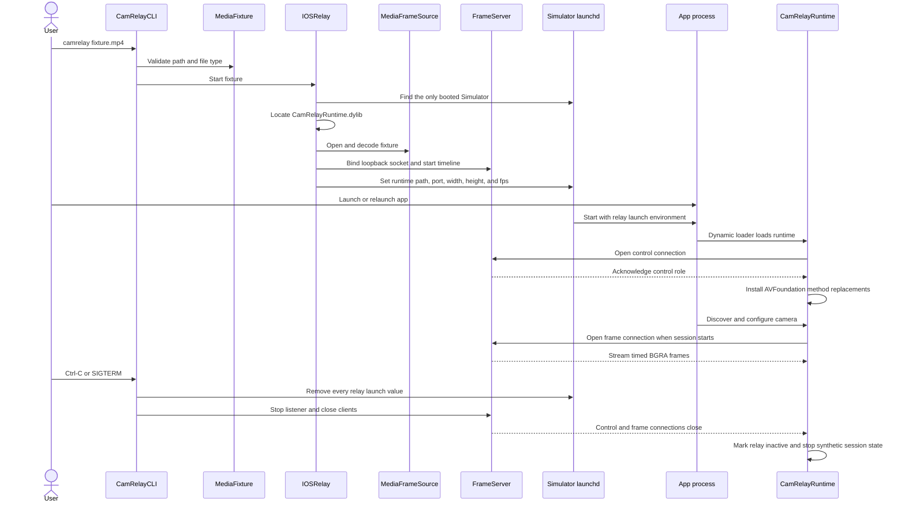
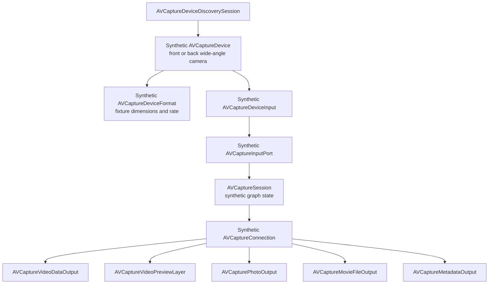

# Architecture

CamRelay supplies image and video fixtures as camera input to apps running in a booted iOS Simulator. The app continues to use standard AVFoundation APIs. CamRelay does not register camera hardware with iOS. It loads a runtime into each new Simulator app process, exposes synthetic AVFoundation objects there, and backs those objects with timed frames from the macOS CLI.

Work is split between the macOS host and Simulator app processes:

- The macOS process validates the fixture, decodes it, controls the Simulator launch environment, and broadcasts frames.
- The Simulator runtime presents the synthetic cameras, maintains capture-session state, and delivers frames through the AVFoundation surfaces used by the app.

## Design constraints

- An app under test does not import or link CamRelay code.
- The app keeps its existing camera setup and uses standard AVFoundation APIs.
- Activation applies to the booted Simulator, not a selected bundle identifier.
- Every connected app receives the same fixture timeline.
- A slow or suspended app cannot slow that timeline for other apps.
- The fixture path and media decoder stay outside app sandboxes.
- The portable core does not depend on Apple frameworks.
- Platform code remains separate so another virtual-device backend can be added later.

## System overview



The CLI owns one frame server. Each app process loads its own runtime and opens its own connections to that server. The server broadcasts a single advancing timeline, so apps that connect at different times join the fixture at its current position.

## Repository components

| Component | Runs in | Responsibility |
| --- | --- | --- |
| `CamRelayCore` | macOS, portable Swift | Validates fixture paths and maps supported file extensions to image or video fixtures. |
| `CamRelayCLI` | macOS | Parses the command, installs signal handling, starts the relay, reports errors, and waits for termination. |
| `CamRelayIOS` | macOS | Finds the Simulator runtime, decodes media, runs the frame server, and controls Simulator activation. |
| `CamRelayRuntime` | iOS Simulator app process | Exposes synthetic AVFoundation behavior and converts incoming frames into camera samples. |
| `CamRelayProbe` | iOS Simulator app process | Exercises common AVFoundation camera surfaces without importing or linking CamRelay. |
| `CamRelayExpo` | iOS Simulator app process | Checks the same feed through the included React Native camera example. |

The Swift package declares `CamRelayCore`, `CamRelayIOS`, and `CamRelayCLI`. The runtime and validation apps are built by shell scripts because they target iOS Simulator rather than the macOS package platform.

## Relay startup and shutdown



The CLI blocks `SIGINT` and `SIGTERM` before starting the relay, then waits with `sigwait`. `IOSRelaySession.stop()` is idempotent. It removes the Simulator launch values before stopping the frame server. This prevents later processes from inheriting an inactive runtime.

If Simulator activation fails after the server starts, `IOSRelay` stops the server before returning the error.

## Fixture validation and media decoding

### Fixture validation

`MediaFixture` expands `~`, standardizes the path, checks that it refers to a file, and classifies the fixture by extension.

Supported image extensions are PNG, JPEG, HEIC, HEIF, TIFF, and BMP. Supported video extensions are MP4, MOV, and M4V.

The core only knows whether a fixture is an image or video. It does not import AVFoundation, Core Video, or other Apple media frameworks.

### Image fixtures

`MediaFrameSource` uses Image I/O to decode an image. It applies embedded image transforms and limits the largest decoded dimension to 1280 pixels. A Core Graphics context renders the image into packed BGRA memory with four bytes per pixel.

An image fixture produces the same pixel payload at 30 frames per second. Presentation timestamps use integer nanosecond arithmetic so the sequence remains monotonic without accumulating a rounded sleep interval.

### Video fixtures

Video decoding uses `AVAssetReader` and the first video track. `AVAssetReaderTrackOutput` requests BGRA pixel buffers with IOSurface backing. Each decoded row is copied into tightly packed BGRA data so the server has a stable frame layout.

The exposed frame rate comes from the track's nominal frame rate, rounded to an integer and limited to the range from 1 through 60. A value of 30 is used when the track does not report a positive rate. Source presentation timestamps still control playback, so variable timestamp spacing is retained even though the exposed format has one integer frame rate.

Each frame carries:

- Packed BGRA bytes
- Presentation time in nanoseconds, relative to the first decoded sample
- Sample duration in nanoseconds

When the reader reaches the end, it starts a new asset reader and adds the asset duration to the loop offset. Presentation timestamps therefore continue increasing across loops. They do not reset to zero at the loop boundary.

Video preferred-transform metadata is not applied. A file whose stored pixels require rotation may appear rotated.

## Timeline scheduling

`FrameServer` schedules the fixture against `DispatchTime` uptime. The first frame establishes a mapping between media time and monotonic host time:

```text
target uptime = uptime origin + (frame presentation time - media origin)
```

The server waits for the absolute target of each frame. Decode and broadcast work do not get added to the next frame interval. If processing falls far enough behind that a frame's display interval has already ended, the server drops that frame and continues toward the current media position.

The scheduler has these properties:

- Source timestamps determine video pacing.
- Image timestamps produce a 30 fps sequence.
- Loop duration follows the source asset duration.
- Late work causes a skipped frame rather than slower playback.

## Frame server and backpressure

The frame server binds an ephemeral TCP port on `127.0.0.1`. It has separate queues for accepting clients, advancing the media timeline, monitoring control connections, and writing to each frame client.

Each frame client has one pending-frame slot. Offering a newer frame replaces an unsent frame in that slot. The writer never builds an unbounded queue, and a client that stops reading cannot block the stream queue or another client.

The server tracks its listener, frame clients, and control clients under a lock. A dispatch group covers active workers so `stop()` can close sockets, wake the scheduler, and wait for worker shutdown before returning.

## CRF2 transport

CRF2 is CamRelay's binary format for sending decoded camera frames from the macOS CLI to the runtime inside each Simulator app. TCP carries the bytes; CRF2 defines how the receiver interprets them. It is a CamRelay protocol, not an AVFoundation API or a video codec.

### Why the processes need a protocol

The CLI and each app runtime run in separate processes. The CLI can open the fixture and decode its frames, but the runtime cannot directly use the CLI's in-memory objects. It needs the pixels and their timing information to construct camera samples inside the app.

TCP provides an ordered byte stream without camera-specific structure. It does not identify image dimensions, frame boundaries, or presentation times. CRF2 defines those details so the sender and receiver agree on how many bytes to write or read and what each field means.

The connection uses `127.0.0.1`, the local loopback address. Frames stay on the Mac and do not pass through an external service. Apps continue to use AVFoundation; only the injected runtime reads CRF2.

### Connection roles

The runtime opens a connection to the server's port and sends one byte to identify its purpose. Control and frame traffic use separate TCP connections to the same server.

| Role byte | Name | Behavior |
| --- | --- | --- |
| `C` (`0x43`) | Control | The server replies with `C` and keeps the connection open. Closing it tells the runtime that the relay ended. |
| `F` (`0x46`) | Frames | The server sends the stream header, followed by timed frame records. |

The control connection opens when the runtime loads. Its acknowledgement confirms that a relay is available before the runtime changes AVFoundation behavior. After that handshake, the connection remains open as a lifetime signal. It does not carry camera settings or periodic heartbeat messages. When the server closes it, the runtime marks the relay inactive.

A frame connection opens when a synthetic capture session starts receiving frames. Keeping it separate allows the runtime to track relay availability even when the app has no running capture session. Each frame client receives the shared fixture timeline through its own connection and bounded writer.

### Stream header and frame records

All integer fields use big-endian byte order: the most significant byte comes first. The sender converts its values to this fixed layout, and the receiver converts them back to native integers. The same layout is used for arm64 and x86_64 runtimes.

After the client sends `F`, the server sends a 20-byte stream header containing five `UInt32` values:

| Field | Meaning |
| --- | --- |
| Magic | `CRF2` (`0x43524632`) |
| Width | Pixel width |
| Height | Pixel height |
| Bytes per row | Packed BGRA row size |
| Frames per second | Integer rate exposed by the synthetic format |

The magic value is the four bytes spelling `CRF2`. The runtime checks it before accepting the stream. The dimensions and row size describe the pixel layout for every frame on that connection, so the server sends this header only once per connection.

BGRA stores four bytes per pixel: blue, green, red, and alpha. Bytes per row tells the receiver where each new row starts. Multiplying it by the height gives the exact pixel payload size.

After the stream header, the server repeatedly sends a frame record containing 16 bytes of timing metadata followed by the pixels:

| Field | Type | Meaning |
| --- | --- | --- |
| Presentation time | `UInt64` | Source presentation time in nanoseconds |
| Duration | `UInt64` | Source frame duration in nanoseconds |
| Pixels | Fixed byte payload | `bytesPerRow * height` BGRA bytes |

For example, a tightly packed 640 by 480 BGRA frame has 2,560 bytes per row and 1,228,800 bytes of pixels. For each frame, the runtime reads the 16 timing bytes, then exactly 1,228,800 pixel bytes, before reading the next record. A socket read may return only part of a record, so the runtime keeps reading until it has the required byte count. It never assumes that one socket read equals one frame.

### How timing reaches the camera outputs

The presentation time identifies where a frame belongs on the fixture timeline. The duration describes the length of that frame's display interval. Both use nanoseconds, with one billion nanoseconds per second. The frame-rate value in the stream header describes the synthetic camera format; it does not replace the per-frame timestamps.

The host scheduler uses source timestamps to pace delivery. The runtime copies the received pixels into a `CVPixelBuffer` and wraps it in a `CMSampleBuffer` with the transmitted presentation time and duration. The runtime's output paths then use that sample for video callbacks, preview, and capture.

If the scheduler or a client's pending-frame slot drops a frame, later frames retain their source timestamps. Their timing does not shift to fill the gap. CRF2 preserves the information needed for playback speed, while the scheduler and output paths are responsible for using it correctly.

### Design tradeoffs

The transport is uncompressed. The host performs media decoding once for the shared timeline, while each app runtime receives a fixed pixel layout and timing metadata. Fixture paths never cross the process boundary, and the app does not need to open the source file or decode its video format.

Raw frames require substantial local bandwidth and memory copying, especially at larger resolutions or with several connected apps. The bounded writers described above prevent one slow client from blocking the others, but they do not remove the cost of sending those pixels.

CamRelay needs a way to exchange frames between processes; iOS does not require that exchange to use CRF2. This format defines the current agreement between the host and runtime. Any replacement must preserve frame timing, independent clients, and relay shutdown behavior, as well as keep fixture access outside the app sandbox.

## Simulator activation

`SimulatorController` uses `xcrun simctl` to find available booted devices. Startup requires exactly one available device in the `Booted` state. Zero or multiple booted devices produce an error rather than an implicit selection.

After the frame server starts, the controller runs `launchctl setenv` inside the selected Simulator with these values:

| Variable | Value |
| --- | --- |
| `DYLD_INSERT_LIBRARIES` | Absolute path to `CamRelayRuntime.dylib` |
| `CAMRELAY_PORT` | Loopback frame-server port |
| `CAMRELAY_WIDTH` | Fixture width |
| `CAMRELAY_HEIGHT` | Fixture height |
| `CAMRELAY_FPS` | Exposed fixture frame rate |

The environment belongs to the booted Simulator. CamRelay does not enumerate installed apps or store a bundle identifier. Any app process launched while these values are present inherits the runtime configuration. A process that was already running must be relaunched because its environment and loaded libraries are already fixed.

Shutdown unsets all five values. CamRelay does not launch, terminate, or otherwise own app processes.

## Runtime loading and activation

`CamRelayRuntime.dylib` has an Objective-C constructor that runs when the dynamic loader maps the library into a process. The constructor reads `CAMRELAY_PORT` and opens a control connection before changing AVFoundation behavior.

The server must acknowledge the `C` role within two seconds. Without that acknowledgement, the constructor returns and installs no method replacements. A successful handshake sets an atomic active flag and starts a utility task that watches the control socket. The flag becomes false when the socket closes.

This control connection separates library presence from relay activity. A process can keep the dynamic library mapped after the host command ends, but the runtime stops advertising an active relay.

## AVFoundation virtualization

The runtime uses Objective-C method replacement to intercept selected class and instance methods. It obtains each method with the Objective-C runtime, installs a replacement implementation, and keeps the original function pointer.

Replacement methods check whether an object belongs to a synthetic capture graph. Calls for synthetic devices, sessions, connections, and outputs use CamRelay behavior. Calls outside that graph continue through the saved AVFoundation implementation.

Associated objects hold synthetic state on AVFoundation objects. This includes capture inputs, outputs, connections, preview layers, running state, camera controls, pending photo requests, and movie recorders.

### Synthetic capture graph



Camera discovery returns synthetic front and back wide-angle devices for video requests. Lookup by unique identifier and default-device APIs return the same objects. Video authorization APIs report access for the synthetic video path.

The synthetic device exposes one format based on the fixture dimensions and frame rate. It also reports the properties commonly inspected during camera setup, including frame-rate ranges, focus and exposure modes, white balance, zoom, orientation, mirroring, and stabilization.

When an app adds a synthetic input to an `AVCaptureSession`, the runtime records it alongside supported outputs and connections. It mirrors the collection and lifecycle APIs that apps use to inspect the configured graph.

## Frame reception inside an app

Starting a synthetic capture session creates one `CamRelayFrameEmitter` for that session. The emitter runs on a serial receiver queue and opens an `F` connection to the host server. If a connection attempt fails while the relay remains active, it waits 100 milliseconds and tries again.

The receiver validates the CRF2 header before allocating a frame buffer. Width and height must be between 1 and 4096, bytes per row must fit at least four bytes per pixel, and the exposed frame rate must be between 1 and 120. Every frame must have a positive duration and timestamps that fit in signed `CMTime` storage.

For each record, the runtime:

1. Copies BGRA rows into a new `CVPixelBuffer`.
2. Creates a video format description for that pixel buffer.
3. Creates a ready `CMSampleBuffer` with the received presentation time and duration.
4. Stores the sample as the session's latest frame.
5. Delivers it to the configured outputs and preview layers.

The sample buffer is the common source for video callbacks, photos, movie recording, metadata detection, and preview rendering.

## Output behavior

### Video-data output

For `AVCaptureVideoDataOutput`, the runtime calls the configured sample-buffer delegate on the queue supplied by the app. The output supports packed BGRA plus full-range and video-range bi-planar YUV.

If the output requests BGRA with no orientation or mirroring transform, the runtime retains the source sample. Other requests pass through a Core Image render into a new pixel buffer. The copied sample keeps the source timing.

### Preview layers

Each synthetic `AVCaptureVideoPreviewLayer` owns an `AVSampleBufferDisplayLayer` sublayer. The runtime keeps the sublayer frame and video gravity matched to the preview layer.

For every preview frame, the runtime copies the sample-buffer wrapper, sets `kCMSampleAttachmentKey_DisplayImmediately`, and submits the sample to `AVSampleBufferVideoRenderer` when the renderer is ready. The renderer owns display work, so the socket receiver does not perform a synchronous image conversion for the preview. A renderer that is not ready simply misses that frame and catches the next one.

Stopping the session flushes pending preview samples and removes the displayed image.

### Photo output

A call to `capturePhotoWithSettings:delegate:` creates a pending photo request. The next frame resolves that request on a background queue.

The runtime creates synthetic `AVCaptureResolvedPhotoSettings` and `AVCapturePhoto` objects, generates JPEG data from the current pixel buffer, and invokes the supported photo delegate callbacks in capture order. Raw and preview photo buffers are not produced.

### Movie-file output

`AVCaptureMovieFileOutput` uses an `AVAssetWriter`. The writer chooses MPEG-4 for an `.mp4` destination and QuickTime Movie for other extensions. App-provided output settings are used when present. Otherwise, the runtime writes H.264 at the fixture dimensions.

The first received frame starts the writer session at that frame's presentation time. Later samples retain their source timestamps. The writer input expects media in real time and appends only while it is ready. Start and finish events use the normal recording delegate methods.

### Metadata output

The supported metadata type is QR code. When the app requests QR metadata, the runtime scans every fifth received frame with a Core Image QR detector. Detected values, bounds, corners, and presentation times are wrapped in synthetic `AVMetadataMachineReadableCodeObject` instances and delivered on the app's metadata callback queue.

## Camera controls

The synthetic device accepts common focus, exposure, white-balance, zoom, orientation, mirroring, and stabilization configuration. Associated objects retain settings that the app may read back.

Orientation and mirroring affect converted video-data samples. Other controls report compatible state but do not change fixture pixels. The fixture remains deterministic regardless of focus, exposure, white-balance, stabilization, or zoom requests.

Depth data, audio capture, raw photos, and metadata types other than QR are not synthesized.

## Concurrency and isolation

The host and runtime use bounded, independent queues rather than one synchronous pipeline.

On the host:

- The accept queue owns new TCP clients.
- The stream queue decodes and advances the shared timeline.
- The control queue monitors runtime lifetime connections.
- Each frame client has a dedicated writer queue and one replaceable pending frame.

Inside an app process:

- Each synthetic capture session has a serial socket receiver queue.
- Video and metadata callbacks use the queues supplied by the app.
- Photo processing runs on a background queue.
- Preview layout updates run on the main queue, while sample rendering stays with the video renderer.

Locks protect server and session lifecycle state. Socket shutdown wakes blocked readers and writers. This structure keeps one app or output from applying backpressure to the fixture timeline used by other apps.

## Error handling

Errors are reported at the boundary where they occur:

- `MediaFixture` reports missing files and unsupported extensions.
- `SimulatorController` reports no booted Simulator, multiple booted Simulators, and failed `simctl` commands.
- `IOSRelay` reports a missing runtime binary and stops a started server when activation fails.
- `MediaFrameSource` reports image decode failures, missing video tracks or frames, and asset-reader failures.
- `FrameServer` reports socket failures and unexpected frame sizes.
- The runtime rejects invalid stream headers and frame metadata instead of allocating or reading an unsafe payload.
- Photo and movie operations return failures through the delegate surfaces expected by the app.

When the host relay disappears, the control connection closes, the runtime marks itself inactive, and active frame receivers stop reconnecting. Synthetic sessions post their normal stopped-running notification when their stream ends.

## Build artifacts and architectures

`Package.swift` builds the host executable for macOS 14 or newer with Swift 6.2.

`scripts/build-runtime.sh` compiles the Objective-C runtime twice, once for arm64 iOS Simulator and once for x86_64 iOS Simulator. Both slices target iOS 18.0 Simulator. The script combines them into `.build/runtime/CamRelayRuntime.dylib`, verifies both architectures, and applies an ad hoc code signature.

The host CLI architecture and app architecture do not need to match. The Simulator app process loads the slice that matches that process. An x86_64 app on Apple Silicon requires the macOS translation component.

Generated runtime, probe, fixture, and example build outputs live under `.build` or ignored example directories. They are not source files.

## Validation architecture

### Unit tests

The unit tests cover fixture classification and missing files, Simulator selection and launch-environment commands, and absolute frame scheduling with expiration behavior.

### Native validation app

`CamRelayProbe` uses standard AVFoundation APIs and has no CamRelay import or link dependency. It checks device discovery, unique-ID lookup, formats, device input ports, capture-session collections, connections, preview state, YUV video frames, photo capture, movie recording, and QR metadata configuration.

The probe automatically requests a photo after five frames. It records from frame 10 through frame 40 and reports the resulting file size. Generated color fixtures let it count observed colors and transitions. The build script emits a universal app and an x86_64-only app.

### React Native validation app

`CamRelayExpo` checks front and back camera discovery and a live preview through the included React Native camera dependency. Its local dependency patch allows Simulator camera setup when AVFoundation returns a video device and avoids configuring an unused audio capture graph. The patch is part of the validation example; apps do not integrate with the CamRelay runtime directly.

## Extension boundaries

New platform backends belong in separate platform modules. Shared fixture validation and orchestration models stay in `CamRelayCore`, while Apple media decoding, Simulator control, and AVFoundation behavior stay in the iOS implementation.

A transport replacement must preserve source timing, deterministic looping, app sandbox isolation, bounded per-client buffering, and cleanup through the control connection. High-resolution changes should be measured with representative 720p and 1080p fixtures.

New camera compatibility should describe general AVFoundation behavior. It should not branch on a particular app or dependency.

## Current limitations

- Only iOS Simulator on macOS is implemented.
- The host executable is currently built and tested on Apple Silicon.
- The synthetic camera exposes one format derived from the fixture.
- Video preferred-transform metadata is not applied.
- Audio, depth data, raw photos, and non-QR metadata are not synthesized.
- Focus, exposure, white-balance, stabilization, and zoom settings do not alter fixture pixels.
- Raw BGRA transport uses substantial loopback bandwidth at high resolutions.
