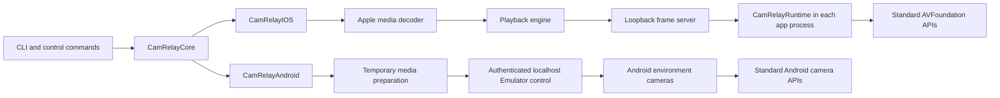
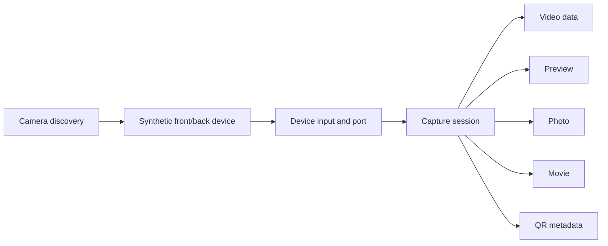

# Architecture

CamRelay turns host-side media into camera input for apps running in virtual mobile devices. The iOS and Android backends share command and fixture models, but use different platform mechanisms to deliver the media.

This document explains how CamRelay is structured and how media reaches an app. See [Usage](usage.md) for commands and [Development](development.md) for tests.

## Design constraints

- Apps under test use standard platform camera APIs and do not link to CamRelay.
- Relay activation is scoped to a virtual device, not to an app identifier.
- Fixture paths and media decoding remain outside app sandboxes.
- Live fixture changes do not require app restarts.
- A slow or suspended iOS app cannot slow the shared timeline for other apps.
- The portable core cannot depend on Apple-only frameworks.
- Platform-specific behavior stays in separate modules.
- Shutdown must undo CamRelay's changes without terminating apps.

## System overview



On iOS, CamRelay controls frame timing and sends decoded pixels to each app runtime. On Android, it prepares the media, then lets the Emulator handle playback and camera delivery.

## Components

| Component | Runs in | Responsibility |
| --- | --- | --- |
| `CamRelayCore` | Portable Swift | Fixture and command models, validation, control messages, leases, and the playback clock |
| `CamRelayCLI` | macOS | Argument parsing, startup and shutdown, terminal input, signals, status, and errors |
| `CamRelayIOS` | macOS | Simulator selection, media decoding, playback, frame transport, and Simulator activation |
| `CamRelayAndroid` | macOS | SDK and AVD discovery, emulator start and stop commands, media preparation, and authenticated control |
| `CamRelayRuntime` | iOS Simulator app | Synthetic AVFoundation objects and camera sample delivery |
| `CamRelayProbe` | iOS Simulator app | Independent validation through standard AVFoundation APIs |
| `CamRelayExpo` | iOS Simulator or Android Emulator | Validation through Expo and `react-native-vision-camera` |

The Swift package builds the four Swift targets. Shell scripts build the iOS runtime and native probe because those artifacts target iOS Simulator rather than the package's macOS platform.

## Session control

A relay exposes a per-user Unix socket at `/tmp/camrelay-<uid>/<session>.sock`. Requests and responses are UTF-8 JSON, each preceded by a four-byte big-endian length. Messages are limited to one megabyte.

The socket directory is private to the current user. Session lock files use advisory exclusive locks and reject unsafe ownership or symbolic links. A stale socket is replaced only while its session lease is held.

A session name addresses a relay process, not an app. A session lease prevents duplicate names. iOS also holds a Simulator lease so differently named relays cannot change the same Simulator launch environment concurrently.

Terminal keys and commands from another process call the same session controller. Playback changes are serialized, including replacement-decoder preparation, so concurrent selections cannot commit out of order. Status and stop requests do not wait behind delivery acknowledgements.

## How iOS delivery works

### Activation

The iOS relay:

1. Selects the only booted Simulator.
2. Locates the injected runtime.
3. Prepares the initial fixture and inspects other decodable fixtures to select the stable output format.
4. Starts the frame server on an ephemeral loopback TCP port.
5. Adds runtime and transport values to the Simulator launch environment.

Apps launched afterward inherit the runtime. When the runtime loads, it first establishes a lifetime connection to the frame server. Only after that handshake succeeds does it replace the relevant AVFoundation behavior. A synthetic capture session opens a separate frame connection.

If activation fails after the server starts, the relay stops the server before returning the error.

### Playback and timing

The supported, decodable fixture with the largest pixel count fixes the iOS output dimensions. A higher frame rate breaks a dimensions tie. The format remains stable across fixture selection, replay, pause, and resume.

`FrameServer` schedules output ticks against an absolute monotonic deadline:

```text
target uptime = uptime origin + output tick × 1,000,000,000 / output fps
```

Decode and broadcast time is not added to the next interval. Late ticks are skipped instead of slowing playback.

`PlaybackClock` maps continuous camera time to source position. Selection resets source position, while pause anchors it and resume excludes the paused interval. Camera presentation timestamps never reset.

`PlaybackEngine` retains the current source frame and one lookahead frame. It repeats or drops source frames according to timestamps when source and output rates differ. A Core Image conversion preserves aspect ratio and fills unused output pixels with black.

Each committed selection, replay, or actual pause/play transition increments a generation. The runtime uses this value to discard obsolete queued work and flush old preview samples.

### CRF3 frame transport

The iOS implementation uses CRF3 to send frames between the macOS server and each injected runtime. It runs over `127.0.0.1` TCP and is neither a codec nor an app-facing API.

The runtime identifies a new connection with one role byte:

| Byte | Role | Purpose |
| --- | --- | --- |
| `C` (`0x43`) | Control | Lifetime signal; the server acknowledges with `C` and keeps the connection open |
| `F` (`0x46`) | Frames | Stream header, frame records, and generation acknowledgements |

After an `F` role byte, the server writes a 20-byte header containing five big-endian `UInt32` values:

| Field | Meaning |
| --- | --- |
| Magic | `CRF3` (`0x43524633`) |
| Width | Output width |
| Height | Output height |
| Bytes per row | Packed BGRA row size |
| Frames per second | Output rate |

Every frame has a 24-byte header containing three big-endian `UInt64` values: generation, continuous presentation time in nanoseconds, and duration in nanoseconds. The header is followed by `bytesPerRow × height` BGRA bytes.

The runtime validates dimensions, row size, frame rate, generation ordering, duration, timestamps, and payload size before creating camera samples. It returns the accepted generation as one big-endian `UInt64`. That acknowledgement powers `--wait-for-frame`.

The acknowledgement confirms runtime receipt, not completion of app callbacks or rendering.

### AVFoundation virtualization

The runtime presents synthetic front and back wide-angle devices. Associated state on AVFoundation objects represents formats, inputs, ports, sessions, outputs, connections, controls, pending photos, preview layers, and movie recorders.



For each incoming frame, the runtime creates a `CVPixelBuffer`, format description, and timed `CMSampleBuffer`. That sample is the common source for video callbacks, previews, photos, movie recording, and metadata detection.

## How Android delivery works

`emulator start` launches a stopped AVD with both cameras set to `environment` and requests an ephemeral, token-protected gRPC endpoint. The Emulator publishes its serial, endpoint, token, AVD identifier, and process information in a private discovery file.

A relay selects the intended AVD, validates that its CamRelay-started Emulator is still running, and reads the idle scene from `environment.ini` without changing that file. Media preparation creates temporary image or video copies that preserve orientation and fit the environment-camera viewport.

Fixture changes send authenticated `setEnvironment` requests to the localhost endpoint. Android playback state is committed only after the request succeeds. The Emulator owns frame timing and looping, so Android does not use CRF3, source-clock pause, or delivery acknowledgements.

Stopping the relay restores the recorded idle scene and removes temporary media. The `emulator stop` command shuts down the AVD.

## Concurrency and isolation

The iOS host uses separate queues for accepting connections, advancing the shared timeline, monitoring lifetime connections, and writing to each frame client.

Each frame client has one replaceable pending-frame slot. A newer frame replaces an unsent one, so a blocked client cannot create an unbounded queue or apply backpressure to the shared timeline.

Inside an app process:

- Each synthetic capture session has a serial socket receiver.
- App video and metadata callbacks use queues supplied by the app.
- Photo processing uses a background queue.
- Preview layout uses the main queue while rendering remains with the sample-buffer renderer.

Socket shutdown wakes blocked workers. Locks protect relay state and capture-session startup and shutdown. Stop operations are idempotent.

## Errors and cleanup

Each layer reports its own errors: fixture validation, device discovery, decoding, activation, transport, runtime validation, or camera control.

Replacement sources are prepared before the active source is changed. A failed preparation therefore preserves the current feed. On iOS, an error after playback begins freezes the last valid pixels and records the decoder error in status.

During iOS shutdown, CamRelay first removes the Simulator launch values, then closes management, frame, and lifetime connections. Loaded runtimes become inactive and synthetic sessions report that they stopped. Android shutdown restores the idle scene before deleting temporary media.
